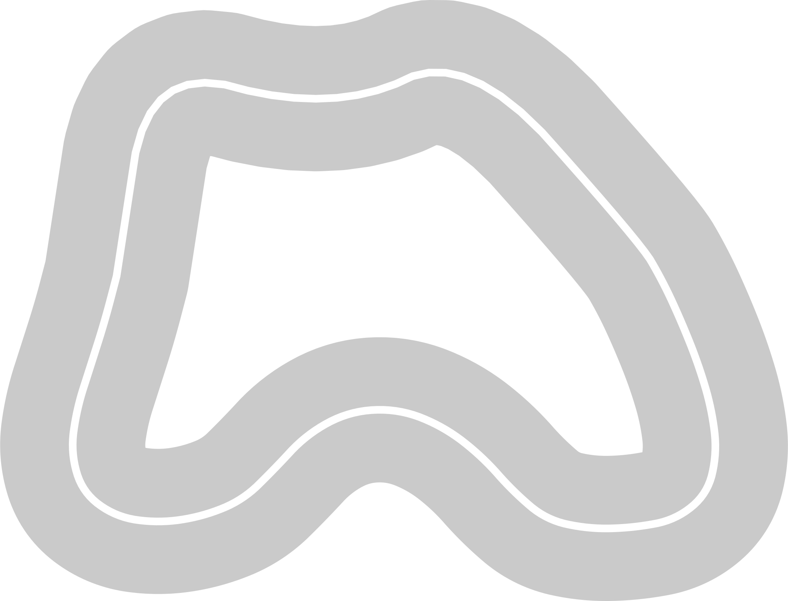
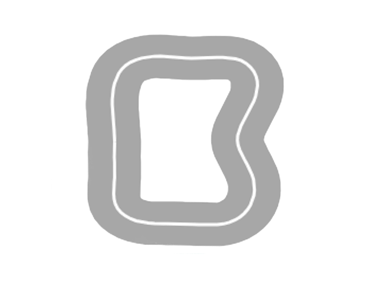

# Track List

| Image                                                             | Name                | Numpy Files                                | Track Length   | Track Width   | Dimensions   | Creator   | Description
|-------------------------------------------------------------------|---------------------|--------------------------------------------|----------------|---------------|--------------|-----------| -------------------
|     | **Amoeba**          | [Amoeba.npy](./Amoeba/routes/Amoeba.npy)   | 15.92 meters   | 0.95 meters   | 5.5m x 4.5m  | Duckworth | Track created for physical racing practice, based on a corner part of the 2022 re:Invent track.
|       | **Bean**            | [Bean.npy](./Bean/routes/Bean.npy)         | 10 meters      | 0.95 meters   | ?            | Ernesto   | Small track created for physical racing practice
