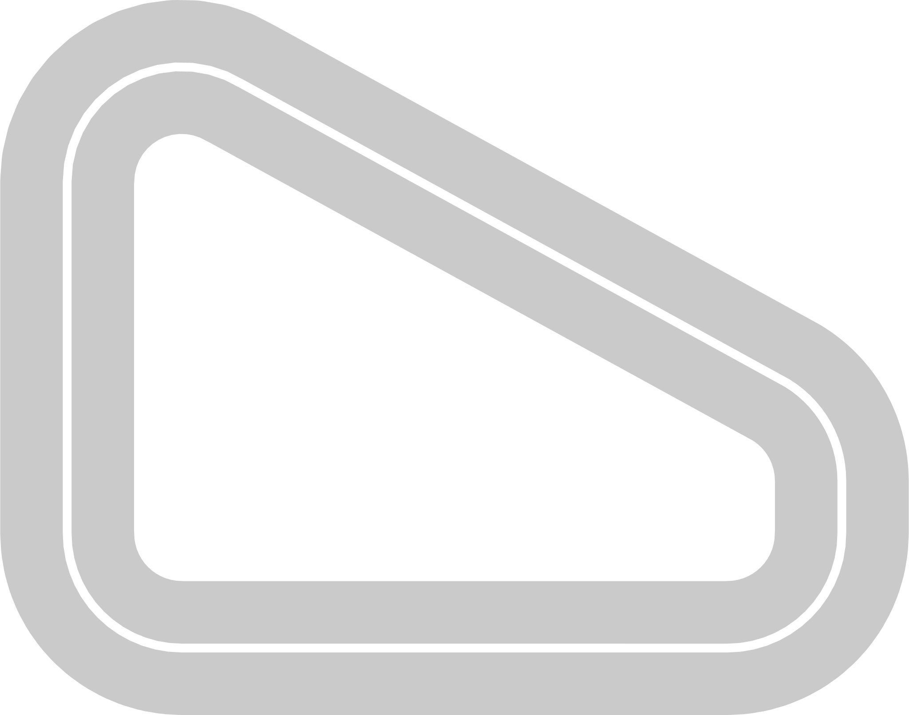

# Track List

## New Tracks

New tracks are tracks whose shape is new / not already included in the normal robomaker images. They can be 100% new, or cut-outs of the original shapes.

| 
Image
                              | Name                                           | Track Dimension    | Creator      | Description
|-------------------------------------------------------------------|------------------------------------------------|--------------------|--------------| -------------------
|     | **Amoeba** ([npy](./Amoeba/routes/Amoeba.npy)) | 15.9 m / 0.95 m   | Duckworth    | Track created for physical racing practice, based on a corner part of the 2022 re:Invent track.
|       | **Bean** ([npy](./Bean/routes/Bean.npy))       | 10 m / 0.95 m      |  Ernesto     | Small track created for physical racing practice
|       | **Trapezoid** ([npy](./Trapezoid/routes/Trapezoid.npy))       | 13.3 m / 0.65 m      |  Duckworth     | Small track created for physical racing practice, maximizing straights

## Customized Tracks

Customized tracks are remixes of original tracks, where features have been added/removed, changed textures etc. Track names are the original track names suffixed by `_custom`.

| 
Image
                              | Name                                | Track Dimension    |  Creator     | Description
|-------------------------------------------------------------------|-------------------------------------|--------------------|--------------|--------------------
|     | **2022_reinvent_champ_custom** ([npy](./2022_reinvent_champ_custom/routes/2022_reinvent_champ_custom.npy))   | 33.27 m / 0.95 m    | Duckworth | Added buildings and configurability.
|       | **2022_summit_speedway_custom** ([npy](./2022_summit_speedway_custom/routes/2022_summit_speedway_custom.npy))         | 25.24 m / 1.07 m             | Duckworth | Added buildings, lights and configurability.
|       | **reinvent_base_custom** ([npy](./reinvent_base_custom/routes/reinvent_base_custom.npy))         | 25.24 m / 1.07 m            | Duckworth | Added buildings, lights and configurability.